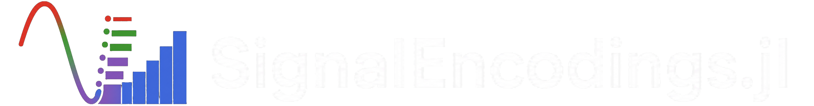

<div align="center">
    
</div>

[](https://PasoStudio73.github.io/SignalEncodings.jl/stable/)
[](https://PasoStudio73.github.io/SignalEncodings.jl/dev/)
[](https://github.com/PasoStudio73/SignalEncodings.jl/actions/workflows/CI.yml?query=branch%3Amain)
[](https://codecov.io/gh/PasoStudio73/SignalEncodings.jl)

A Julia package for **discretizing numeric signals into bins** (a.k.a. quantization).

`SignalEncodings.jl` provides three algorithms — uniform, quantile, and Jenks-style iterative —
and supports a wide range of input layouts:

- **scalar vectors** (1-D signals)
- **tabular data** (`n_samples × n_features` matrices)
- **time series** (each cell is a 1-D array)
- **images** (each cell is a 2-D array)
- **arbitrary tensors** (each cell is an N-D array)

---

## Installation

```julia
using Pkg
Pkg.add("SignalEncodings")
```

---

## Algorithms

| Config | Strategy | Key parameters |
|---|---|---|
| `Uniform` | Linearly spaced edges between min and max | `nbins` |
| `Quantile` | Edges at empirical quantiles | `nbins`, `type` |
| `Jenks` | Iterative break optimization minimizing within-bin deviation | `nbins`, `maxiter`, `flux`, `errornorm` |

All configs share `nbins`, `max_nobs`, and `rng` for a uniform interface.

---

## Quick start

### Tabular data

```julia
using SignalEncodings

X = rand(Float32, 100, 4)   # 100 samples, 4 features

config = Uniform(; nbins=16)
X_bin, edges = bin(config, X)

config = Quantile(; nbins=16, type=:linear)
X_bin, edges = bin(config, X)

config = Jenks(; nbins=16, errornorm=:l1)
X_bin, edges = bin(config, X)
```

### Time series

```julia
# Each cell is a 1-D time series vector
X = [rand(Float32, 50) for i in 1:30, j in 1:4]   # 30 samples, 4 channels

config = Uniform(; nbins=32)
X_bin, edges = bin(config, X)
```

### Images

```julia
# Each cell is a 2-D image
X = [rand(Float32, 8, 8) for i in 1:20, j in 1:3]   # 20 samples, 3 channels

config = Quantile(; nbins=8)
X_bin, edges = bin(config, X)
```

### Arbitrary tensors

```julia
# Each cell is a 3-D tensor
X = [rand(Float32, 3, 4, 4) for i in 1:10, j in 1:2]

config = Jenks(; nbins=4, errornorm=:l2)
X_bin, edges = bin(config, X)
```

---

## Configuration reference

### `Uniform`

```julia
Uniform(; nbins=64, max_nobs=1000, rng=Xoshiro(42))
```

- `nbins`: number of bins (`2 ≤ nbins ≤ 255`).
- `max_nobs`: per-bin sampling cap for edge estimation.
- `rng`: RNG for reproducible subsampling.

### `Quantile`

```julia
Quantile(; type=:linear, nbins=64, max_nobs=1000, rng=Xoshiro(42))
```

- `type`: quantile interpolation method — one of `:linear`, `:inverted`,
  `:average`, `:median`, `:normal`, `:matlab`.
- `nbins`, `max_nobs`, `rng`: as above.

### `Jenks`

```julia
Jenks(; nbins=64, maxiter=200, flux=0.1, fluxadjust=1.03,
        fluxadjust_bothways=true, errornorm=:l1,
        max_nobs=1000, rng=Xoshiro(42))
```

- `maxiter`: maximum optimization iterations.
- `flux`: initial boundary-shift ratio per iteration.
- `fluxadjust`: multiplicative flux adaptation factor.
- `fluxadjust_bothways`: allow flux to increase and decrease adaptively.
- `errornorm`: `:l1` (sum of absolute deviations) or `:l2` (sum of squared deviations).
- `nbins`, `max_nobs`, `rng`: as above.

---

## Output

`bin` always returns a tuple `(X_bin, edges)`:

- `X_bin`: binned indices (`UInt8`, 1-based). For multidimensional inputs the
  original item shape is preserved.
- `edges`: one edge vector per feature/column.

---

## License

MIT License

---

## About

Developed by the [ACLAI Lab](https://aclai.unife.it/en/) @
University of Ferrara.